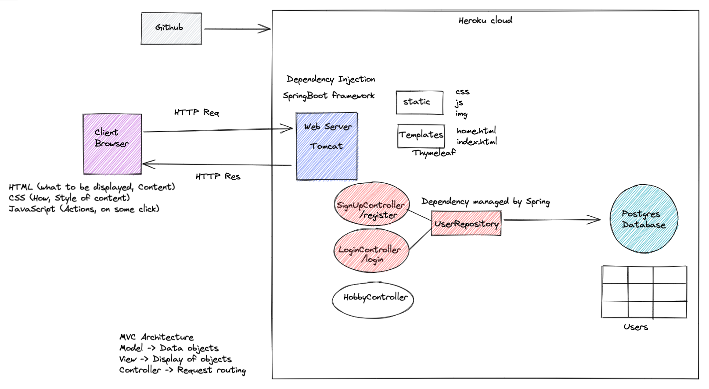

# Hobbycircle
HobbyCircle is a web application where users can discuss their hobbies with other users and 
find common things to do. 

It is developed using SpringBoot, Bootstrap, Postgres and deployed in Heroku. 

# Design 

# Build and Deploy
The project uses Gradle for build management and Heroku cloud for deployment.
